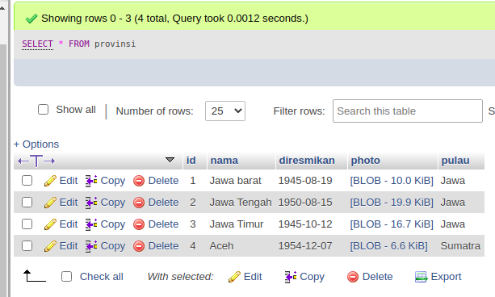

<h1 align="center"> dumbways </h1>

    This repository contains my answer for Bootcamp Dumbways Test Batch 17. I use javascript and python programming language and MySql database for answer the problem dan using visual studio code as a text editor.

<h3> for the answers number 1 - 3 you can run in online editors like https://glot.io/ </h3>

    Query to display all data from the provinsi table
    
    Query to display all data from the provinsi table and kabupaten table
    
    Query to display all data from the provinsi table located on the island of sumatra
    

